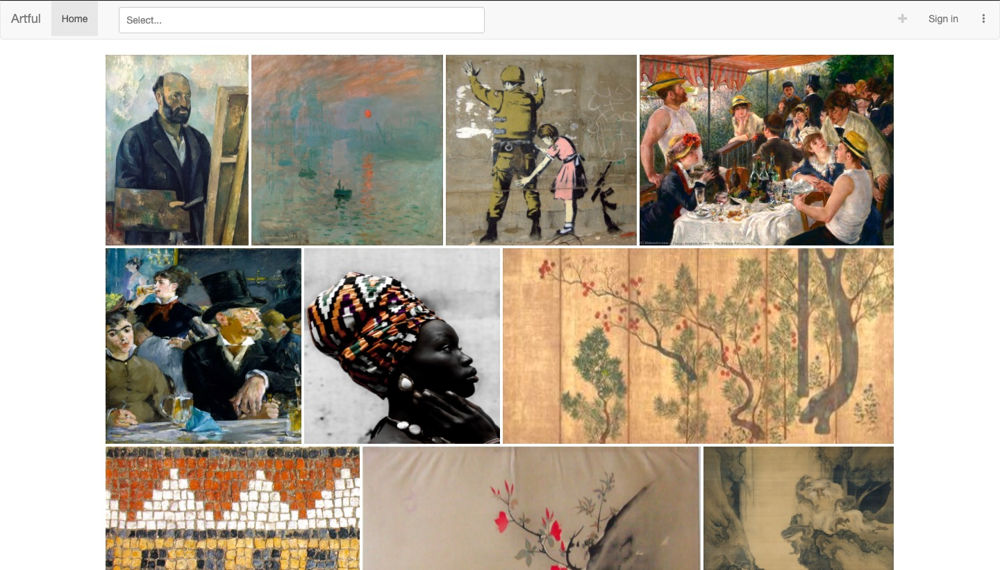
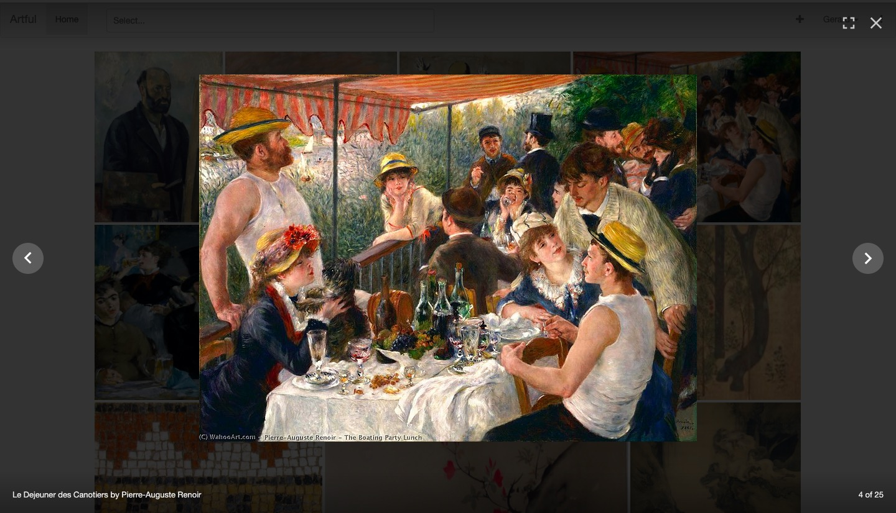
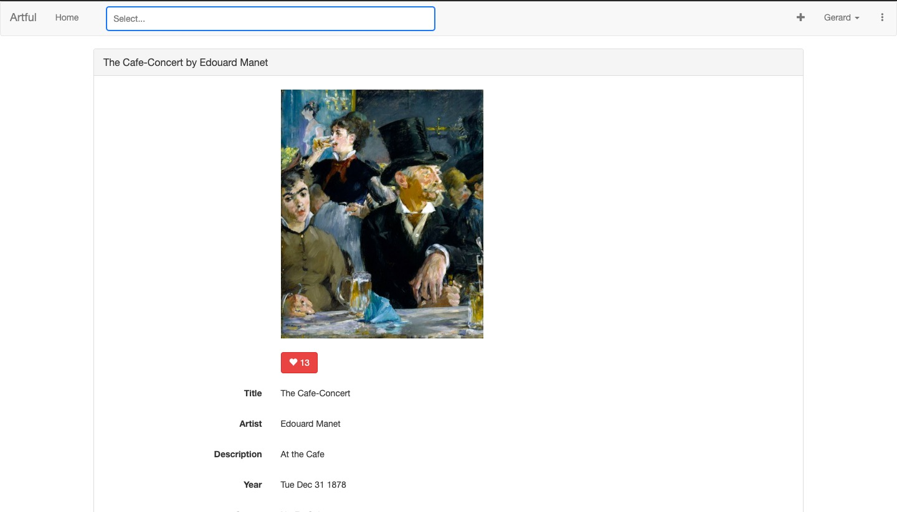
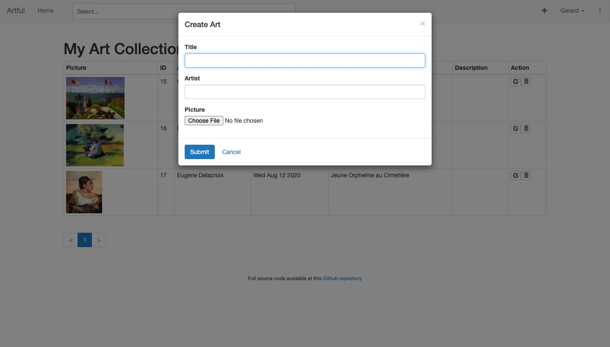
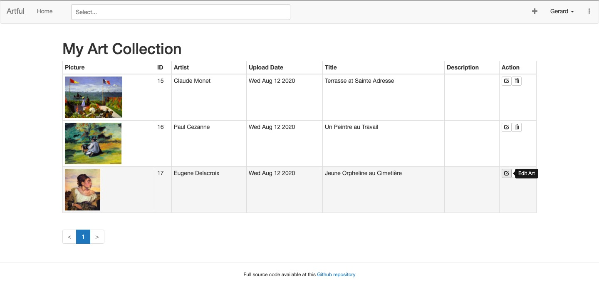
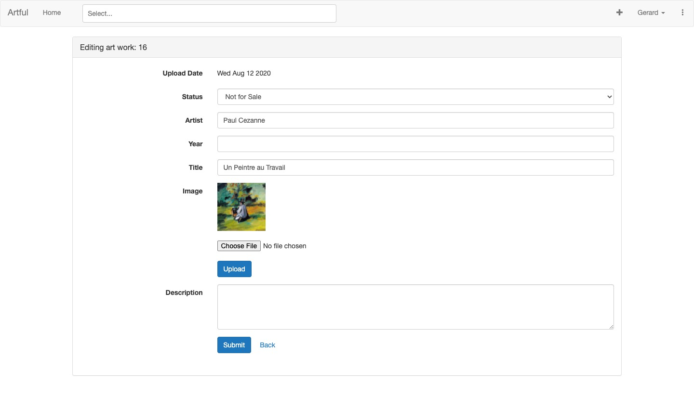
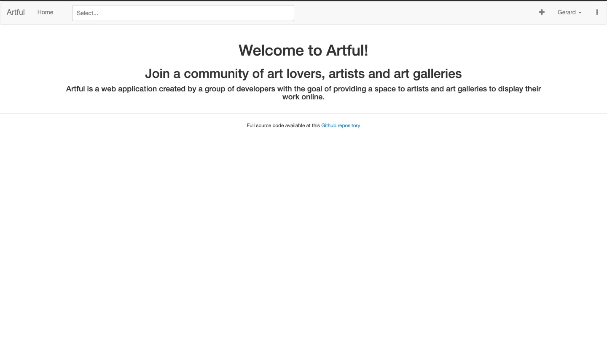

# Artful

### Deployed Site

* https://artful-ui.herokuapp.com/art

## Team

- Ivy Gooch
- Gerard Otalora
- Peter Laudat
- Prisca Joseph

## Description

Artful is a web application that allows users to browse work made by artists and displayed by galleries. 
The users can start a new account in order to interact with the artists and their work (liking, commenting, etc). 
Artists and galleries can also sign in their accounts and will have a profile page to add and organize and tag their work.
This full-stack web application has been developed using the MERN stack (i.e. MongoDB, Express, React and Node). 

## Images

