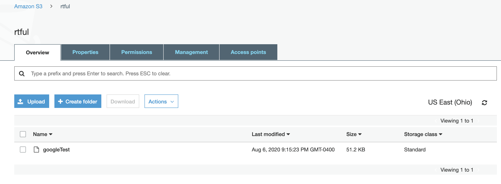
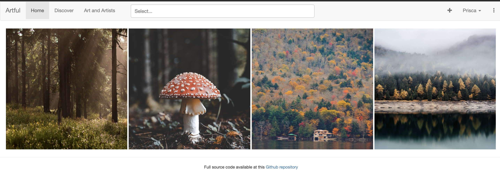
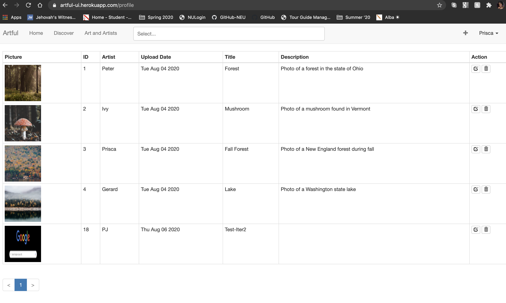

# Artful UI by LooselyTyped

## Team

- Ivy Gooch
- Gerard Otalora
- Peter Laudat
- Prisca Joseph

## Description

Artful is a web application that allows users to browse work made by artists and displayed by galleries. The users can start a new account in order to interact with the artists and their work (liking, commenting, etc). Artists and galleries can also sign in their accounts and will have a profile page to add and organize and tag their work.

This full-stack web application has been developed using the MERN stack (i.e. MongoDB, Express, React and Node). It is composed of two applications, implemented and stored in this repo and [Artful API](https://github.ccs.neu.edu/NEU-CS5610-SU20/GroupProject_LooselyTyped_API).

## Iteration 3

### Tagged Release:

* [Artful API Release Iteration 3](https://github.ccs.neu.edu/NEU-CS5610-SU20/GroupProject_LooselyTyped_API/releases/tag/iteration3)

* [Artful UI Release Iteration 3](https://github.ccs.neu.edu/NEU-CS5610-SU20/GroupProject_LooselyTyped_UI/releases/tag/iteration3)

### Deployed Site (UI)

* http://artful-ui.herokuapp.com/art

### Iteration 3 Contributions

#### Ivy Gooch

* 

#### Prisca Joseph

* 

#### Gerard Otalora

* Created ArtInfo a new page that users can access through searching an art piece or selecting one of their art pieces in profile. This page displays information about the art piece such as title, author, year, etc as well as rendering a thumbnail of the picture and the number of likes that the piece has gotten. 
* Improved user experience including a few toasts when the user uploads a picture, to get some info that the art piece is loading as well as a few error toasts if the user forgets to upload a picture.

#### Peter Laudat

* Integrated the Amazon Web Services file upload feature in ArtEdit.jsx page so users may replace or update images for a given Art record. As for file upload in the AddArt.jsx modal, this feature: 
** grabs the file name and posts it in a request for an Amazon S3 storage uri and signed request from ui/ArtEdit to api/sign_s3
** api/sign_s3 turn posts the request to Amazon AWS S3, which returns the uri

## Iteration 2

**Our Tagged Release:**

[Artful API Release Iteration 2](https://github.ccs.neu.edu/NEU-CS5610-SU20/GroupProject_LooselyTyped_API/releases/tag/iteration2)

[Artful UI Release Iteration 2](https://github.ccs.neu.edu/NEU-CS5610-SU20/GroupProject_LooselyTyped_UI/releases/tag/iteration2)

**Deployed Site (UI):** http://artful-ui.herokuapp.com/art

**Progress** 

I. Ability to add art

 - When the art is added to the application it added to the Amazon S3 and the mongo database. S3 is a webservice for storage, we found that this was the easiest place to store images instead of storing it locally.

II. The main home page has an improved interface

 - Instead of the list view on the home page it now displays a gallery. The gallery now has the a carousel feature when an art is selected. 

 - We are still continuing to improve the home page and the entire flow of the application. We hope to improve the flow of the application for a more natural user flow. 

III. An updated Profile page

 - We have an art list page with allows users to to edit the art that they have uploaded.

 - Users are able to update (edit) information on an art piece and delete an art that has undo functionality

 - We added to the table to have the description displayed on the table.

IV. Other adjustments away from issue tracker

 - More appropriate name changes throughout the application. This includes changing names and refrences to the following: 
    - Owner to Artist
    - Due to Year
    - Created to UploadedDate
- We also decided to not render features that are not applicable to our app.

## Iteration 1

Our tagged releases are listed below:

- 

- 

For iteration 1, we :

- pulled Professor Mullen's IssueTracker code, tested it, changed all issue references to art references, 

- confirmed that the front and back ends worked together and all base CRUD operations work correctly, so users can create, read, update, and delete art records

- modified the modal (ArtAddNavItem) in the UI so users have select file and upload buttons to select images from the desktop

- modified init.mongo.db, schema.graphql, and ArtTable to enable the inclusion, association, and display of free public images from  in art records after record creation

- we decided on the following third party libraries to integrate into our project:
  -  Photo Gallery: http://neptunian.github.io/react-photo-gallery/
  - Minimalist Searchbox: https://github.com/axmz/react-searchbox-awesome
  - Flicking (mobile): https://naver.github.io/egjs-flicking/
  - Facebook Login: https://github.com/seeden/react-facebook
  - React Avatar Generator (Profiles): https://github.com/JosephSmith127/react-avatar-generator
  - React Star Rating: https://github.com/cameronroe/react-star-rating
  - React Images Crop: https://github.com/ricardo-ch/react-easy-crop

The snapshots below indicate some of the progress to date:

We planned to deliver an image file upload feature in this iteration and have put many hours into exploration and integration of at least three different approaches; we expect to release that feature in iteration 2.

Our git repository's record of commit authors probably might not tell the whole story of the extent of our team members' participation. All members have been deeply engaged and fully participative, working on the code when separated, as well as together in daily multi-hour quadruple-programming sessions. Gerard or Peter have typically been sharing screen and updating the code while the other three design, research, and otherwise supply direction. We are all novices, so the progress may be a little slower than for other teams, but we are making progress and learning together.
